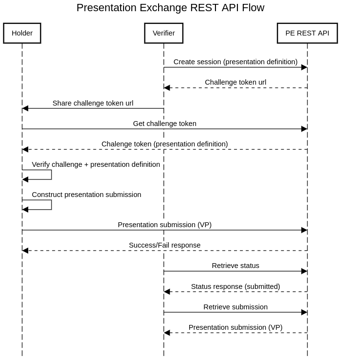

# Interface Specification for Presentation Exchange REST API
The goal of the REST API for Presentation Exchange is to:
* Expose the functionality of the [PE Library](./interface_specification_of_pe_library_component.md) for use in any language
* Provide stateful interaction mediation between holders and verifiers

The general flow diagram would look as follows:


## API

### Initiation
`POST /exchange`

#### Description
Initiate a new Verifier/Holder interaction

#### Parameters
Request Body:
```json
{
  "presentation_definition": {...},
  "challenge": "1e84250c-25a7-444c-a42b-0a8c43d900e6",
  "holder": "did:example:12345"
}
```
#### Response

* `200`: OK

    Response Body
    
    ```json
    {
      "challengeTokenUrl": "https://example.io/exchange/1234"
    }
    ```
* `400`: Invalid request
  
  Response Body
  
  ```json
  {
    "errors": [...]
  }
  ```

### Challenge / Presentation Definition retrieval
`GET /exchange/{sessionId}`
#### Parameters
Path Variables:
* `sessionId`: the session id returned from the `POST /exchange` initiation call
#### Response
* `200`: Success
  
    Response Body
    ```json
    {
      "presentation_definition": {...},
      "callback": "https://example.io/exchange/1234/submission",
      "challenge": "1e84250c-25a7-444c-a42b-0a8c43d900e6"
    }
    ```
* `404`: Session not found

### Presentation Submission
`POST /exchange/{sessionId}/submission`
#### Description
Submit a requested presentation
#### Parameters
Path Variables:
* `sessionId`: the session id associated with the interaction
Request Body:
```json
{
  "verifiablePresentation": {
    ...
  }
}
```
#### Response
* `200`: Success
  
    Response body
    ```json
    {
      "warnings": [...]
    }
    ```
* `400`: Invalid Request
  
    Response Body
    ```json
    {
      "warnings": [...],
      "errors": [...]
    }
    ```

### Retrieve Presentation Submission
`GET /exchange/{sessionId}/submission`

#### Description
Retrieve a presentation submission as a verifier as part of a credential exchange session.

#### Parameters

Path Variables:
* `sessionId`: the session id associated with the interaction
  
#### Response
* `200`: Success
  
  Request Body:
    ```json
    {
      "verifiablePresentation": {
        ...
      },
      "warnings": [...],
      "errors": [...]
    }
    ```
* `404`: Submission not found

### Status check
`GET /exchange/{sessionId}/status`
#### Description
Check on the status of an ongoing exchange session
#### Parameters
Path Variables:
* `sessionId`: the session id associated with the interaction
#### Response
* `200`: Success
  
  Response Body
    ```json
    {
      "status": "SUBMITTED"
    }
    ```
  * `status` can have values `CREATED`, `REQUEST_RETRIEVED`, `SUBMITTED` and `SUBMISSION_RETRIEVED`
    
* `404`: Exchange session not found

