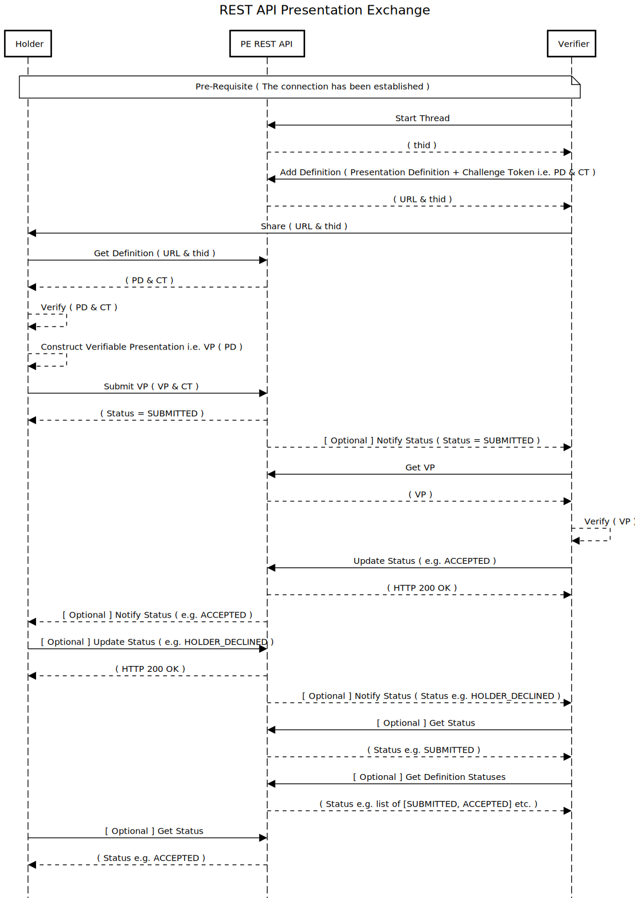

# Interface Specification for Presentation Exchange REST API

The goal of the REST API for Presentation Exchange is to:

* Expose the functionality of the [PE Library](./interface_specification_of_pe_library_component.md) for use in any language
* Provide stateful interaction mediation between holders and verifiers

<br/>




## API

* [Presentation Definition POST](#presentation-definition-post)
* [Presentation Definition Challenge GET](#presentation-definition-challenge-get)
* [Presentation POST](#presentation-post)
* [Status Notification to Verifier](#status-notification-to-verifier)
* [Verifiable Presentation GET](#verifiable-presentation-get)
* [Status POST](#status-post)
* [Status Notification to Holder](#status-notification-to-holder)
* [Status GET](#status-get)


### Presentation Definition POST

`POST /exchange`


#### Description

Initiate a new Verifier/Holder interaction by creating a Presentation Definition.


#### Parameters

Request Body:
```json
{
  "presentation_definition": {...},
  "challenge": {
    "holder": "did:example:12345",
    "token": "1e84250c-25a7-444c-a42b-0a8c43d900e6"
  },
  "callback": {
    "url":"https://verifier-example.io/status/12345"
  }
}
```


#### Response

* `200`: OK

    Response Body
    
    ```json
    {
      "sessionUrl": "https://pe-rest-api-example.io/exchange/1234"
    }
    ```
* `400`: Invalid request
  
  Response Body
  
  ```json
  {
    "errors": [...]
  }
  ```


### Presentation Definition Challenge GET

`GET /exchange/{sessionId}`


#### Parameters

Path Variables:

* `sessionId`: the session id returned from the `POST /exchange` initiation call


#### Response

* `200`: Success
  
    Response Body
    ```json
    {
        "presentation_definition": {...},
        "challenge": {
          "holder": "did:example:12345",
          "token": "1e84250c-25a7-444c-a42b-0a8c43d900e6"
        }
    }
    ```
* `404`: Session not found


### Presentation POST

`POST /exchange/{sessionId}/presentations`


#### Description

Submit a requested presentation


#### Parameters

Path Variables:
* `sessionId`: the session id associated with the interaction


Request Body:
  ```json
  {
    "verifiablePresentation": {
      ...
    },
    "callback": {
      "url": "https://holder-example.io/status/1234"
    }
  }
  ```


#### Response
* `200`: Success
  
    Response body
    ```json
    {
      "presentationId": "presentationId", 
      "warnings": [...]
    }
    ```

* `202`: Accepted
    Verifier can respond immediately with `202 accepted`, or it can invoke an HTTP API later asynchronously.

* `400`: Invalid Request
  
    Response Body
    ```json
    {
      "warnings": [...],
      "errors": [...]
    }
    ```


### Status Notification to verifier

`Put <verifier-example.io>/exchange/{sessionId}/status`


#### Description

This is an optional interaction and hence verifier can choose not to implement it. The PE REST Backend invokes an HTTP REST API exposed by the verifier to notify about the status of exchange.


#### Parameters

Path Variables:
* `sessionId`: the session id associated with the interaction

Request Body:
```json
{
  "status": "SUBMITTED"
}
```

#### Response

* `200`: Success

* `404`: Exchange session not found


### Verifiable Presentation GET

`GET GET /exchange/{sessionId}/presentations/{presentationId}`


#### Description

Retrieve a presentation submission as a verifier as part of a credential exchange session.


#### Parameters

Path Variables:
* `sessionId`: the session id associated with the interaction
  

#### Response

* `200`: Success
  
  Response Body:
    ```json
    {
      "verifiablePresentation": {
        ...
      },
      "warnings": [...],
      "errors": [...]
    }
    ```
* `404`: Submission not found


### Status POST

`Post /exchange/{sessionId}/status`


#### Description

Verifier can update the status from `SUBMITTED` to `ACCEPTED` by calling this API.


#### Parameters

Path Variables:
* `sessionId`: the session id associated with the interaction
  Request Body:
    ```json
    {
      "status": "ACCEPTED",
      "message": "The submission has been accepted without reservation"
    }
    ```


#### Response

* `200`: Success

* `404`: Submission not found


### Status notification to holder

`Put <holder-example.io>/exchange/{sessionId}/status`


#### Description

This is an optional interaction and hence holder can choose not to implement it. The PE REST Backend invokes an HTTP REST API exposed by the holder to notify about the status of exchange.

#### Parameters

Path Variables:
* `sessionId`: the session id associated with the interaction

Request Body:
```json
{
  "status": "ACCEPTED"
}
```

#### Response

* `200`: Success


* `404`: Exchange session not found


### Status GET

`GET /exchange/{sessionId}/status`


#### Description

Check on the status of an ongoing exchange session


#### Parameters

Path Variables:
* `sessionId`: the session id associated with the interaction


#### Response

* `200`: Success
  
  Response Body
    ```json
    {
      "status": "SUBMITTED"
    }
    ```
  * `status` can contain the following values:
      * `CREATED`: create a session http request was successful
      * `SUBMITTED`: Holder responded with a submission
      * `HOLDER_DECLINED`: (holder_refused)Holder explicitly declined, Holder called some API to update the status.
      * `EXPIRED`: Holder did not respond at all or did not respond in time.
      * `ACCEPTED`: (completed/verified/valid/approved) Submission was accepted by the verifier.
      * `VERIFIER_DECLINED`: (verifier_rejected) Submission was rejected by verifier
    
* `404`: Exchange session not found
