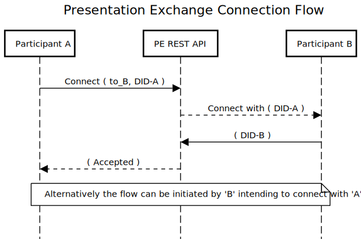

# Interface Specification for Presentation Exchange REST API

The goal of the REST API for Presentation Exchange is to:

* Expose the functionality of the [PE Library](./interface_specification_of_pe_library_component.md) for use in any language
* Provide stateful interaction mediation between holders and verifiers

## Legends

 

## PE REST API Connection Flow
 

## PE REST API Presentation Exchange

 

## API
* [Connection invitations POST](pe_openapi/apis/v1/a0_pe_invitations_post.md)
* [Connection invitations GET](pe_openapi/apis/v1/a1_pe_invitations_get.md)
* [Connection POST](pe_openapi/apis/v1/a2_pe_connections_post.md)
* [Presentation (New Thread) POST](pe_openapi/apis/v1/b0_pe_post.md)
* [Definitions POST](pe_openapi/apis/v1/c0_pe_definitions_post.md)
* [Definitions GET](pe_openapi/apis/v1/c1_pe_definitions_get.md)
* [Presentations POST](pe_openapi/apis/v1/d0_pe_presentations_post.md)
* [Definition Statuses PUT](pe_openapi/apis/v1/d1_pe_definition_statuses_put.md)
* [Definition Statuses GET](pe_openapi/apis/v1/d2_pe_definition_statuses_get.md)
* [Presentation GET](pe_openapi/apis/v1/d3_pe_presentation_get.md)
* [Presentations GET](pe_openapi/apis/v1/d4_pe_presentations_get.md)
* [Presentation Statuses POST](pe_openapi/apis/v1/e0_pe_presentation_statuses_post.md)
* [Presentation Statuses PUT](pe_openapi/apis/v1/e1_pe_presentation_statuses_put.md)
* [Presentation statuses GET](pe_openapi/apis/v1/e2_pe_presentation_statuses_get.md)

